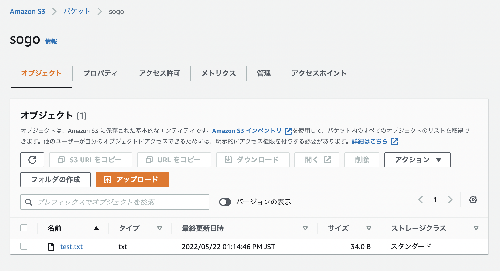

This is sample code using AWS S3 by Java.

## How to build and Run test

```
export AWS_PROFILE=sandbox
mvn package
```

### AWS Console (if success)



## Reference

- About Credentials
https://docs.aws.amazon.com/ja_jp/sdk-for-java/v1/developer-guide/setup-credentials.html

- Samples from AWS
https://docs.aws.amazon.com/ja_jp/sdk-for-java/v1/developer-guide/examples-s3.html
